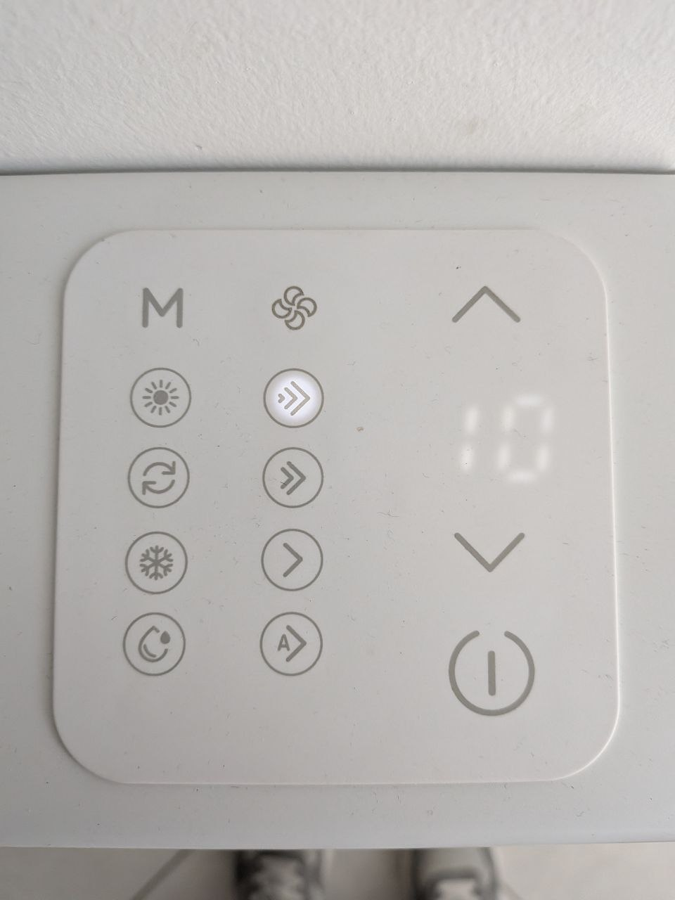

# Ideal Clima Nemo 1000 — local control (ESP32-C3)

> ⚠️ **Unofficial integration — use at your own risk.** This is an independent,
> community reverse-engineering project. It is **not** affiliated with, endorsed by,
> or supported by Ideal Clima or Tuya. It involves opening the unit and wiring to
> internal connectors, which **may void your warranty** and carries a risk of
> damaging the appliance, the electronics, or yourself. **The author accepts no
> liability** for any damage, malfunction, injury, or loss resulting from the use of
> this project. If you proceed, you do so entirely at your own risk. See the
> [LICENSE](LICENSE) (provided "AS IS", without warranty of any kind).

Reverse engineering and **local** integration of the **Ideal Clima Nemo 1000** fancoil
without the original TQCT07 Wi-Fi dongle and without the Tuya cloud.

An ESP32-C3 connects to the **CN2** connector (the Wi-Fi module slot) and emulates the module,
speaking the **Tuya MCU** protocol with the display board. You get **full read** of the
state and **full control** (power, temperature, mode, fan).

> ✅ Protocol verified on the real device: reading and writing both working.

> **Compatibility:** tested on the **Nemo 1000**. The protocol is model-agnostic
> (standard Tuya MCU on CN2), so it is likely compatible with other **Nemo** models —
> but those have **not been tested**. If you try it on another model, feedback is welcome.

## What you can control / read

| Function | Tuya DP | Type | Values |
|---|---|---|---|
| Power | 1 | bool | on / off |
| Setpoint | 2 | int | 0–40 °C |
| Ambient temp | 3 | int | sensor reading |
| Mode | 4 | enum | cool / heat / dehu / fan |
| Fan | 5 | enum | superlow / low / medium / high / auto |
| Fault | 6 | bitmap | diagnostics |

> Note: the board emits **ambient temp (DP3)** and **fault (DP6)** only at cold boot
> (full state dump after a power-cycle), not on every change. So `current_temperature`
> may read 0 until the fancoil is unplugged/replugged — this is the hardware's behaviour,
> not a bug.

### Display panel



How the front-panel icons map to the values above:

| Icon (panel) | Function | Tuya value |
|---|---|---|
| `M` | Mode cycle | DP4 |
| ☀ sun rays | Heat | `heat` (1) |
| ❄ snowflake | Cool | `cool` (0) |
| ↻ recirculation | Fan only | `fan` (3) |
| 💧 drop | Dehumidify | `dehu` (2) |
| ⚙ fan | Fan-speed cycle | DP5 |
| `»` / `»»` / `›` | Low / medium / high | `low` / `medium` / `high` |
| `A»` | Auto | `auto` (4) |
| ⌃ / ⌄ | Setpoint up / down | DP2 |
| ⏻ | Power | DP1 |

The four mode icons map to DP4 values cool / heat / dehu / fan. The exact
recirculation-vs-drop icon assignment is inferred from the panel; the
authoritative source is the DP4 mapping in the table above.

## Two Home Assistant integrations (pick the one you prefer)

### Option 1 — ESPHome (native API, recommended)
No MQTT broker, automatic discovery, OTA. See [`esphome/`](esphome/).
- Custom `ideal_clima_fancoil` component (native `climate` entity)
- Example config: [`esphome/ideal_clima_fancoil.yaml`](esphome/ideal_clima_fancoil.yaml)

Flash:
```bash
cd esphome
cp secrets.yaml.example secrets.yaml   # fill in Wi-Fi + generate keys
esphome run ideal_clima_fancoil.yaml
```

### Option 2 — MQTT
For those who already run a broker (Mosquitto). Automatic Home Assistant discovery. See [`mqtt/`](mqtt/).
- PlatformIO firmware: [`mqtt/`](mqtt/) (uses the core library + PubSubClient + ArduinoJson)

Flash:
```bash
cd mqtt
cp secrets.ini.example secrets.ini     # fill in Wi-Fi + broker
pio run -t upload
```
Full details and HA discovery notes in [`mqtt/README.md`](mqtt/README.md).

Both share the same core library **IdealClimaTuya** in [`esp32/`](esp32/).

## Repository layout

```
esp32/        Core C++ library (IdealClimaTuya) + Arduino example + wiring guide
esphome/      ESPHome component + example YAML
mqtt/         PlatformIO firmware with MQTT + HA discovery (see mqtt/README.md)
extra/        PC tools: passive bus sniff/decode + terminal control (Python + USB-TTL)
board_images/ Photos of the display board (CN1/CN2 connectors, silkscreen)
CLAUDE.md     Full technical notes: protocol, hardware, reverse engineering
```

## Wiring (summary)

CN2 is a **5-pin JST 1.25mm** connector: `+5V / T / R / S / GND`. A pre-crimped
JST 1.25mm 5-pin pigtail mates with it — e.g. [this one on AliExpress](https://it.aliexpress.com/item/1005010705677089.html)
(any equivalent JST 1.25mm 5-pin cable works).

```
CN2 pin2 (T) --------------> ESP RX   (direct, 3.3V)
CN2 pin3 (R) <-------------- ESP TX   (direct, 3.3V)
CN2 pin5 (GND) ------------- ESP GND
CN2 pin1 (+5V) --- optional: power the ESP
CN2 pin4 (S)   --- do not connect (leave high)
```

✅ Both data lines (T and R) operate at **3.3V** (verified), so they connect
**directly** to the ESP32-C3 GPIOs — no divider, no level shifter, no resistors.
Details in [`esp32/WIRING.md`](esp32/WIRING.md).

## Tuya MCU protocol (summary)

- UART **9600 8N1**, frame `55 AA <ver> <cmd> <len_hi> <len_lo> <data...> <checksum>`
- **Checksum** = sum of **all** bytes (including `55 AA`) `& 0xFF`
- Version: module→MCU commands = `00`, MCU→module responses = `03`
- A **handshake** is required (heartbeat → product → working mode → network status → query DP)
  plus a **continuous heartbeat** (~1s) before commands are applied
- Tuya product ID: `5dgguakbmhwzwiko`

Full details and the reverse-engineering history in [`CLAUDE.md`](CLAUDE.md).

## Credits

DP mapping based in part on
[tuya-local ideal_clima_fancoil.yaml](https://github.com/deltaclock/tuya-local/blob/master/custom_components/tuya_local/devices/ideal_clima_fancoil.yaml).

## License

MIT — see [`LICENSE`](LICENSE).
